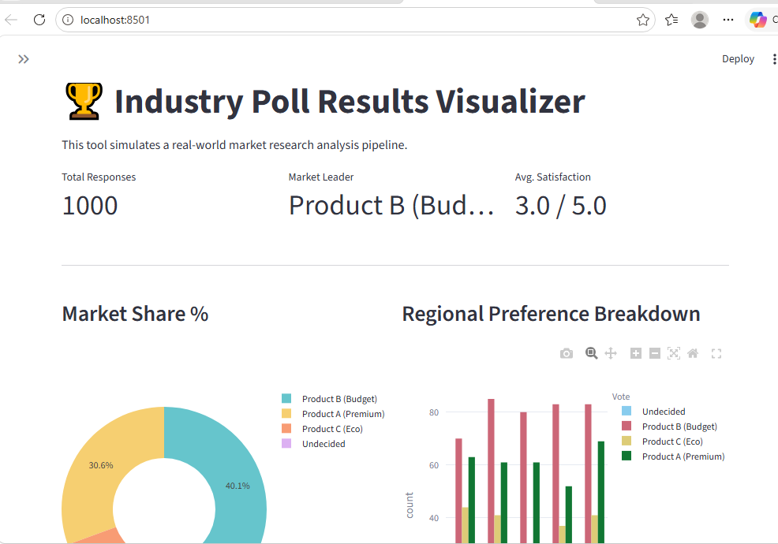
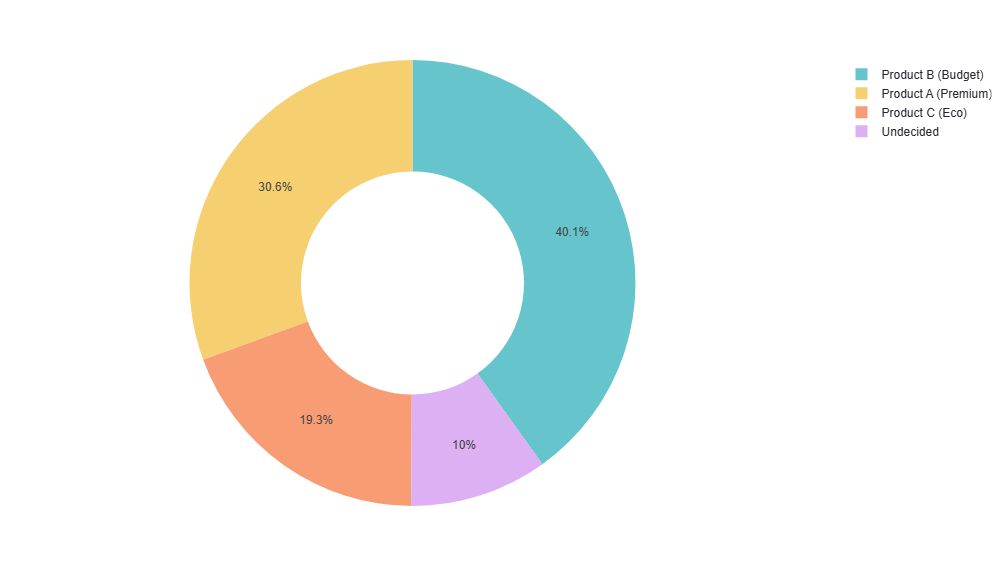
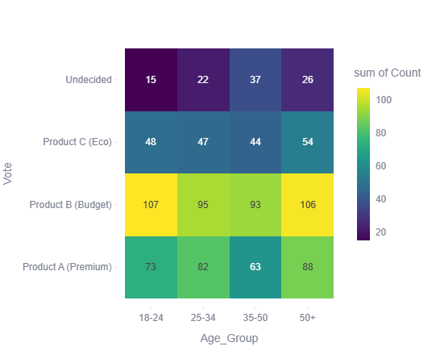

# 📊 Poll Results Visualizer

A professional Data Analytics project built to transform raw survey data into actionable business insights. This project showcases a modular data pipeline: **Data Engineering (src) ➔ User Interface (Streamlit) ➔ Statistical Insights.**

## 🖥️ Project Preview


## 🚀 Key Features
- **Modular Architecture:** Separates data logic (`src/`) from the display layer (`app.py`).
- **Interactive Dashboard:** Real-time data exploration with Streamlit.
- **Market Segmentation:** Regional breakdown of preferences (North America, Asia-Pacific, etc.).
- **Demographic Heatmaps:** Deep-dive analysis of Age Groups vs. Product Choices.
- **Synthetic Data Engine:** Custom NumPy engine simulating 1,000+ respondents with weighted market probabilities.

## 📊 Analytics Deep-Dive
| Market Share Analysis | Demographic Heatmap |
| :--- | :--- |
|  |  |

## 🛠️ Tech Stack
- **Language:** Python 3.10+
- **Data Manipulation:** Pandas, NumPy
- **Interactive Visuals:** Plotly Express
- **Web Framework:** Streamlit
- **Version Control:** Git & GitHub

## 📁 Project Structure
```text
Poll-Results-Visualizer/
│
├── data/               # Raw survey CSV files & sample datasets
├── images/             # Dashboard screenshots for GitHub documentation
├── outputs/            # Exported business reports & summary statistics
├── src/                # Modular Logic: data_engine.py (The backend)
├── venv/               # Virtual Environment (Local only - ignored by Git)
├── app.py              # Main Entry Point: Dashboard UI & Frontend
├── requirements.txt    # List of required Python libraries
└── README.md           # Professional project documentation

## How to run project 
git clone <https://github.com/AseemTapase123/Poll-Results-Visualizer>

cd Poll-Results-Visualizer
.\venv\Scripts\activate

pip install -r requirements.txt

streamlit run app.py